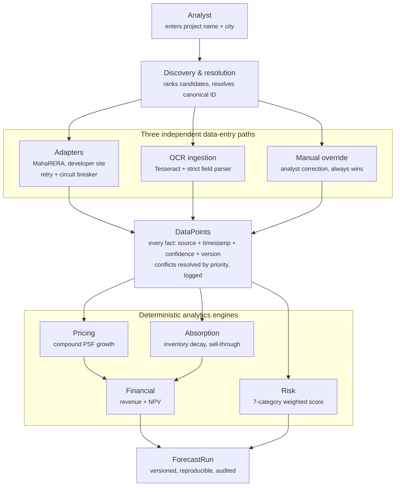
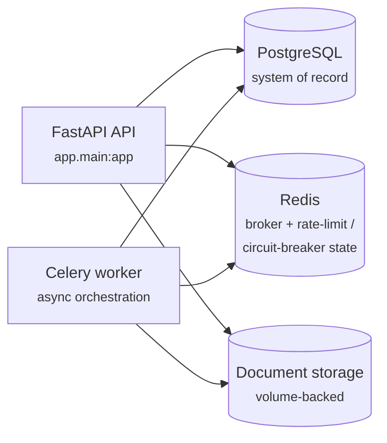

# UnderwritingAI — Investment Committee Intelligence Platform

An internal, deterministic real-estate underwriting platform for a Real Estate Asset Management Company. It discovers and tracks projects, acquires and reconciles data from multiple sources, and runs versioned financial/risk analytics — all as pure, reproducible calculations. AI is deliberately kept out of anything that computes a number; it is reserved for turning already-validated structured data into report prose (not yet built — see [Roadmap](#roadmap)).

Full design rationale lives in [`docs/PRD.md`](docs/PRD.md) (product requirements), [`docs/ARD.md`](docs/ARD.md) (architecture decision records), and [`docs/SAD.md`](docs/SAD.md) (software architecture document).

## Core philosophy

- **Deterministic core, AI presentation-only.** Every number an investment committee sees is produced by plain Python — compound growth, decay curves, NPV, weighted risk scores. No LLM is ever in the calculation path.
- **Provenance on every fact.** Every value in the system is a row in a `data_points` table carrying its **source, timestamp, confidence, and version**. Nothing is just "the current unit count" — it's "450, from MahaRERA, fetched 2026-07-10, confidence 0.95, version 3."
- **Conflicts are surfaced, never silently resolved.** When two sources disagree, a deterministic per-field-type priority rule picks a winner, but the loser is logged, not discarded — so a future report can disclose *both* values and why one won.
- **Reproducibility over cleverness.** Every analytics run pins the exact input versions it read (`input_manifest`), so re-running against unchanged inputs is provably byte-identical. This is a tested invariant, not a claim.

## Architecture at a glance

Modular monolith — one deployable FastAPI service, internally split into bounded-context packages (`app/identity`, `app/discovery`, `app/acquisition`, `app/analytics`, ...) that each own their tables and expose a narrow service-layer interface. Async I/O throughout (FastAPI + SQLAlchemy 2.0 async + asyncpg), with Celery/Redis for background orchestration and Postgres as the single durable source of truth.



**Deployment topology** (Docker Compose locally; India-region cloud is the target for production per the SAD):



## End-to-end flow

1. **Analyst search → Discovery & resolution.** `CompositeRanker` scores candidate projects on exact name, fuzzy name, city, and historical-selection signals. Above a calibrated confidence threshold it auto-resolves to a `CanonicalProject`; otherwise the analyst confirms from ranked candidates. Every later step hangs off this one stable ID.

2. **Three independent paths write into the same store.**
   - **Adapters** — `AcquisitionOrchestrator` calls source adapters (MahaRERA, developer site) through retry/backoff, a circuit breaker, and rate limiting. Fixture-backed today; live scraping is gated behind pending legal review.
   - **OCR ingestion** — scanned quarterly reports go through real Tesseract OCR, then a strict regex parser that rejects ambiguous matches rather than risk extracting a wrong value from noisy text.
   - **Manual override** — an analyst can directly correct any field. This always wins over automated conflict resolution; fields flagged `requires_override_review` additionally get a non-blocking reviewer sign-off afterward.

3. **DataPoints is the hub.** Every value lands here as a row with source, timestamp, confidence, and version. Confidence is a composite: `source_confidence × ocr_confidence% × extraction_confidence%`, multiplicatively dampened, so a shaky OCR read can never look as trustworthy as a clean API fetch. When sources disagree, `write_field` resolves by configured per-field-type source priority and logs the losing value + reason to `ConflictResolutionLog` — never averaged, never silently dropped.

4. **Analytics engines read current DataPoints and produce ForecastRuns.** `run_all_engines` runs four pure, DB-free calculation functions in dependency order — **Pricing** (compound growth) → **Absorption** (geometric decay, analytically-solved sell-through) → **Financial** (composes both into revenue + NPV) → **Risk** (7-category weighted composite, honest about categories with no data source yet). Each run is persisted with an `input_manifest` pinning the exact `DataPoint` versions read, making it independently reproducible and auditable.

## Roadmap

| Milestone | Scope | Status |
|---|---|---|
| M0 | Foundations — auth, RBAC, Celery/Postgres skeleton | ✅ Done |
| M1 | Discovery & resolution — deterministic project matching | ✅ Done |
| M2 | Data acquisition — adapters, orchestrator, conflict resolution | ✅ Done |
| M3 | Document/OCR ingestion — real Tesseract + strict parsing | ✅ Done |
| M4 | Manual override workflow — human correction, reviewer sign-off | ✅ Done |
| M5 | Base analytics engines — pricing, absorption, financial, risk | ✅ Done |
| M6 | Scenario engine — Bear/Base/Bull assumption variants | ⏳ Not started |
| M7+ | Report generation — LLM prose over validated JSON, with a blocking numeric-traceability guardrail | ⏳ Not started |
| M8–M10 | Scheduled refresh, hardening, second-adapter/provider swap (proves no lock-in) | ⏳ Not started |

Currently: **100 automated tests passing** (unit + integration, against real Postgres/Redis/Tesseract — no mocked infrastructure), migrations at head `8e63d4bc4437`.

## Running locally

```bash
docker compose up -d          # postgres, redis, api, worker
docker compose exec api alembic upgrade head
```

API is served at `http://localhost:8000` (interactive docs at `/docs`). Postgres and document storage persist across restarts via named volumes (`postgres_data`, `document_storage`).

### Tests

```bash
python -m pytest -q
```

Requires the Docker Postgres/Redis services running (tests hit real infrastructure, not mocks/SQLite).

## Project layout

```
app/
  core/          shared config, DB engine, security, Celery app, object storage
  identity/      users, roles, permissions, auth (RBAC via require_permission)
  discovery/     project search + deterministic candidate ranking
  adapters/      external data source adapters (MahaRERA, developer site, ...)
  acquisition/   orchestrator, normalization/conflict resolution, OCR ingestion, overrides
  ocr/           OCR provider abstraction (Tesseract)
  analytics/     pricing / absorption / financial / risk engines + ForecastRun persistence
docs/            PRD, ARD, SAD
tests/
  unit/          pure-function and component tests
  integration/   API tests against real Postgres/Redis
```

Each `app/<context>/` package owns its tables and exposes `repository.py` / `service.py` / `api.py` — other contexts never reach into another's ORM models directly.
