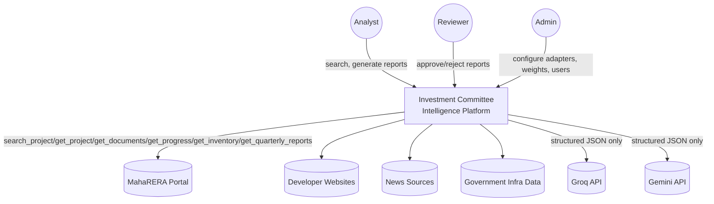
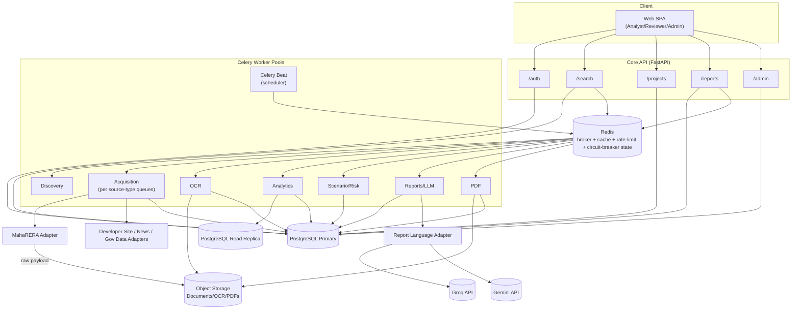
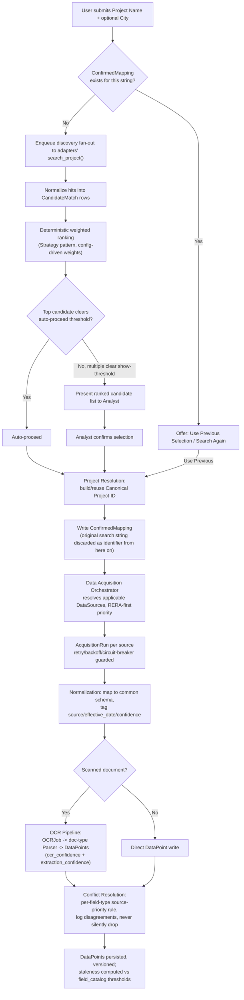
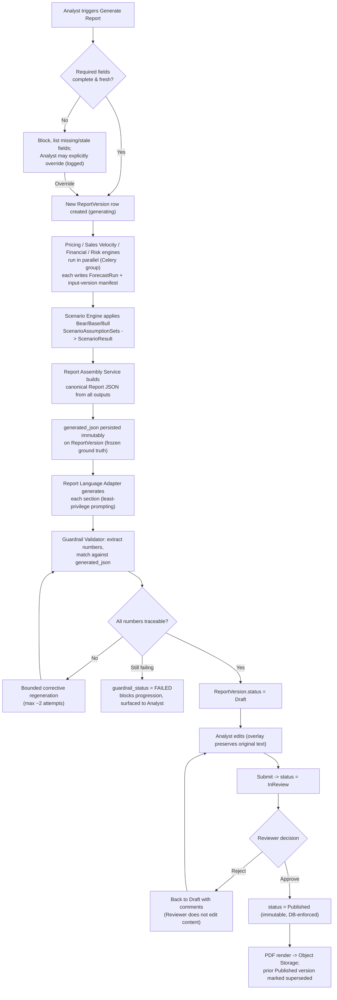
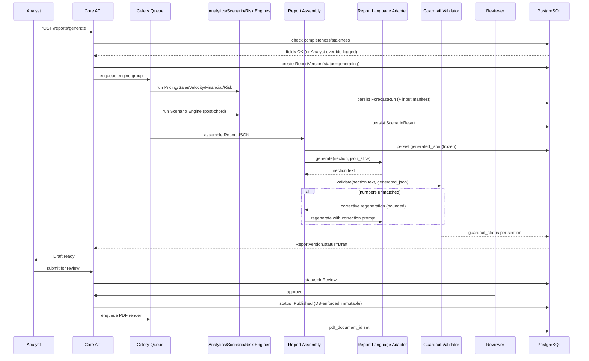
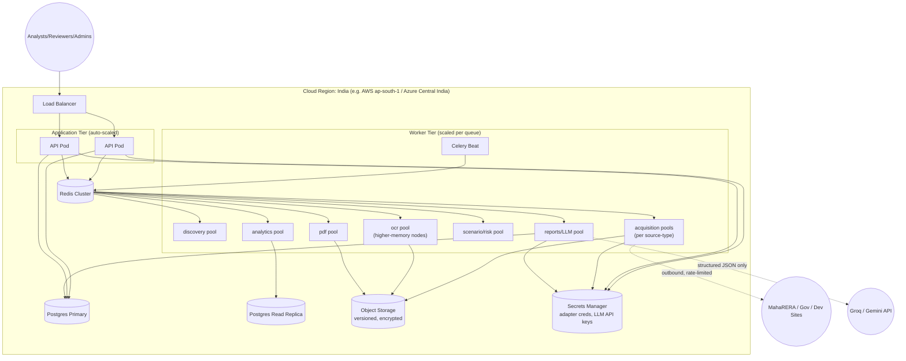

# Software Architecture Document

## Investment Committee Intelligence Platform

**Companion documents:** `PRD.md` (product requirements), `ARD.md` (architecture decision records — this document assumes those decisions and doesn't re-litigate rationale already covered there).

**Confirmed technical baseline:** Python (FastAPI + Celery/Redis), PostgreSQL (primary + read replica), object storage, India cloud region, provider-agnostic LLM interface (Groq/Gemini at MVP, Claude-ready), modular monolith sized for mid-scale (multiple offices, dozens of analysts, hundreds of tracked projects).

---

## 1. Context Diagram



## 2. Domain Model

**Identity & Resolution**
- `Developer` — canonical developer record (name, known aliases).
- `CanonicalProject` — resolved project identity. Key: `(state, rera_registration_number, developer_id, project_name_canonical)`. Holds only identity fields — enriched attributes live as `DataPoint`s, not columns (see §8).
- `SearchQuery` — raw user input (`raw_text`, `city_hint`, `user_id`, `created_at`).
- `CandidateMatch` — one scored candidate from a discovery run: per-field scores, composite score, chosen flag. Retained for audit and for tuning ranking weights.
- `ConfirmedMapping` — `normalized_search_string → canonical_project_id`, confidence-at-confirmation, confirmed_by/at, hit_count, last_used_at.

**Data Acquisition & Provenance**
- `DataSource` — configured source instance (adapter_type, jurisdiction, reliability/priority tier, rate-limit policy, active flag, legal-review-signoff flag).
- `AcquisitionRun` — one orchestrator execution against one `DataSource` for one project (status, retries, error detail).
- `Document` — a raw fetched artifact (PDF/HTML), object-storage pointer, doc_type, source, checksum.
- `OCRJob` — takes a `Document`, produces extracted fields; records engine/version and OCR confidence.
- `DataPoint` — the atomic fact: entity reference, typed value, source, `effective_date` (as-of date) vs. `fetched_at`, `source_confidence`/`ocr_confidence`/`extraction_confidence`/`composite_confidence`, `version`, `status` (active/superseded/conflicting/overridden/rejected), `previous_data_point_id` (version chain).
- `ConflictResolutionLog` — winner/loser DataPoint ids, field, rule applied, resolved_at.
- `ManualOverrideDetail` — companion row for `manual_override`-sourced DataPoints: user, reason, previous value, optional reviewer sign-off.
- `FieldCatalog` / `AssumptionRegistry` — versioned config: field types/ranges, per-field-type source-priority order, staleness thresholds, ranking weights, confidence-combination formula, LLM/provider selection.

**Analytics / Scenario / Risk**
- `ForecastRun` — one engine execution: `engine_type`, `engine_version`, `config_version_id`, `input_manifest` (exact DataPoint versions read — makes reproducibility checkable), output JSON.
- `ScenarioAssumptionSet` — named, versioned bundle (bear/base/bull/custom) of assumption values.
- `ScenarioResult` — output of applying a `ScenarioAssumptionSet` to base `ForecastRun` outputs.
- `RiskScore` — category scores + composite, `methodology_version`.

**Reporting**
- `Report` — project-scoped aggregate, `current_version_id`.
- `ReportVersion` — the immutable audit unit: `version_number`, `status` (Draft/InReview/Published/Rejected/Superseded), `generated_json` (frozen LLM input snapshot), `llm_provider`, `guardrail_status`, `guardrail_report`, `pdf_document_id`, `created_by/reviewed_by/published_by`, `superseded_by_version_id`.
- `ReportSection` — per-section generated text, analyst-edited overlay, guardrail result.

**Identity/Audit**
- `User`, `Role`, `Permission`, `UserRole` (optional scope column reserved for future office-scoping), `AuthIdentity` (provider + external_subject_id — supports local and SSO simultaneously), `AuditLogEntry` (append-only: actor, action, entity, before/after, correlation_id).

**Relationships (summary):** `Developer` 1—N `CanonicalProject`. `CanonicalProject` 1—N `DataPoint`/`Document`/`ForecastRun`/`Report`. `DataSource` 1—N `AcquisitionRun` 1—N `DataPoint`/`Document`. `Document` 1—N `OCRJob` 1—N `DataPoint`. `ScenarioAssumptionSet` 1—N `ScenarioResult`; `ForecastRun` 1—N `ScenarioResult`/`RiskScore`. `Report` 1—N `ReportVersion` (append-only) 1—N `ReportSection`. `SearchQuery` N—1 `ConfirmedMapping` N—1 `CanonicalProject`. `User` 1—N `UserRole` N—1 `Role` N—N `Permission`.

## 3. Bounded Contexts

Single deployable, internally partitioned with owned tables and a narrow published interface (Python Protocols + Pydantic schemas). No context imports another's ORM models directly — only its repository/service interface. This is the seam that allows a future extraction into a standalone service without a rewrite.

1. **Identity & Access** — owns `User`/`Role`/`Permission`/`AuthIdentity`/`AuditLogEntry`. Exposes `get_current_user`, `require_permission(...)` as FastAPI dependencies, and `AuditRecorder.record(event)` used in-process by every other context.
2. **Discovery & Resolution** — owns `SearchQuery`, `CandidateMatch`, `ConfirmedMapping`, and `CanonicalProject`'s identity fields. Contains the deterministic ranking service (Strategy pattern — see §9). Produces the `CanonicalProjectID` handed downstream.
3. **Data Acquisition & Normalization** — owns `DataSource`, `AcquisitionRun`, `Document`, `OCRJob`, `DataPoint`, `ConflictResolutionLog`, `ManualOverrideDetail`. Sub-divided internally into: Adapter Framework, OCR Pipeline, Normalization/Conflict-Resolution Engine. Exposes exactly one read surface to everything downstream: `ProjectDataRepository.get_current_view(project_id) -> NormalizedProjectView`. **Analytics never sees `DataSource`, `Document`, or raw adapter payloads** — this facade is what makes "analytics never knows which source supplied data" a structural property, not a convention.
4. **Analytics/Forecasting** — owns `ForecastRun` and the Pricing, Sales Velocity, and Financial Forecast Engines. Each reads only `NormalizedProjectView` + pinned config.
5. **Scenario & Risk** — owns `ScenarioAssumptionSet`, `ScenarioResult`, `RiskScore`, the Risk Engine, and the Scenario Engine. Consumes Analytics/Forecasting's outputs rather than raw project data — a different data-ownership shape, hence a separate context (see ARD discussion; a valid alternative would fold this into Analytics/Forecasting).
6. **Report Generation** — owns `Report`, `ReportVersion`, `ReportSection`, the Report Language Adapter, the Guardrail Validator, PDF export, and the Draft→Review→Publish state machine. Reads from Analytics/Forecasting, Scenario & Risk, and the `NormalizedProjectView` facade; writes nothing back into any of them.

## 4. Component Diagram



## 5. Data Flow Diagrams

### 5.1 New Project Search → Persisted DataPoints



### 5.2 Report Generation → Draft/Review/Publish



## 6. Sequence Diagram — Report Generation (Audit-Critical Path)



## 7. Deployment Diagram



## 8. Database Design

Single PostgreSQL instance (primary + read replica), India region. No polyglot persistence for MVP — JSONB absorbs schema variability while relational FKs/transactions preserve auditability (see ADR-002, ADR-003).

**Key tables:** `developers`, `canonical_projects`, `data_sources`, `acquisition_runs`, `documents`, `ocr_jobs`, `data_points`, `conflict_resolution_logs`, `manual_override_details`, `forecast_runs`, `scenario_assumption_sets`, `scenario_results`, `risk_scores`, `reports`, `report_versions`, `report_sections`, `report_section_edits`, `users`, `roles`, `user_roles`, `auth_identities`, `permissions`, `role_permissions`, `search_queries`, `candidate_matches`, `confirmed_mappings`, `audit_log_entries` (append-only; partition by month once volume warrants it), `assumption_registry`, `field_catalog`.

**`data_points` (the central table):**
```
data_points(
  id, entity_type, entity_id, field_name,
  value_type, value_text, value_numeric, value_date, value_json,
  version, is_current, status,
  source_id, source_ref, acquisition_run_id, ocr_job_id,
  effective_date, fetched_at,
  source_confidence, ocr_confidence, extraction_confidence, composite_confidence,
  previous_data_point_id, created_at
)
```
Indexes: `(entity_type, entity_id, field_name, is_current)` for current-value lookups; `(entity_type, entity_id, field_name, effective_date)` for history/time-travel queries.

**Fast read path:** a derived, denormalized `project_current_facts` snapshot table/materialized view per entity type, refreshed transactionally alongside every `data_points` write, serves Analytics and Report Assembly. `data_points` remains the append-only source of truth; the snapshot is rebuildable from it at any time.

**`report_versions` immutability:** append-only per `report_id`; a DB trigger (or row-level policy) raises on any attempted UPDATE where `OLD.status='published'` — enforced at the database layer, not only the application layer. `generated_json` is the frozen LLM input; `guardrail_report` (JSONB) stores the full per-section traceability breakdown for reviewer inspection. `report_section_edits` retains every analyst edit as a diff so the original LLM output is never silently lost.

**Conflict/override history:** a losing `DataPoint` is never deleted — marked `conflicting`/`superseded` and linked from `conflict_resolution_logs`. Manual corrections are ordinary `DataPoint` rows (source = reserved `manual_override` DataSource) plus a `manual_override_details` companion row — one unified history mechanism regardless of provenance (ADR-014).

## 9. Adapter Framework

**Common interface** (Protocol/ABC): `search_project(criteria) -> List[CandidateResult]`, `get_project(external_ref) -> RawProjectPayload`, `get_documents(external_ref) -> List[RawDocumentRef]`, `get_progress(external_ref) -> RawProgressPayload`, `get_inventory(external_ref) -> RawInventoryPayload`, `get_quarterly_reports(external_ref) -> List[RawQuarterlyReportRef]`. Metadata per adapter: `adapter_id`, `jurisdiction`, capability flags, rate-limit policy, politeness policy (robots.txt/crawl-delay), auth requirements.

**Registry:** `(jurisdiction/source_type) -> adapter class`, resolved at runtime from `data_sources` config rows. Adding a state = new class + config row, zero orchestrator changes.

**Orchestrator responsibilities:**
- Resolve applicable `DataSource`s per project; order by priority (authoritative RERA source first).
- Retry with exponential backoff + jitter, bounded attempts, retryable vs. non-retryable error classification.
- Circuit breaker per `DataSource`, Redis-backed, cooldown + half-open probe.
- Rate limiting (Redis token bucket) + response caching (TTL, conditional requests where supported) — the concrete mitigation for scraping/ToS risk (ARD ADR-005, PRD §16).
- Partial-data handling: `AcquisitionRun.status` reflects success/partial/failed; partial data still flows to Normalization, gated by the staleness/completeness policy — never silently treated as complete.
- CAPTCHA/scanned-only handling: adapters return an explicit "requires OCR fallback" or "requires manual entry" signal, never a fabricated result.

**OCR pipeline** as its own stage: any `Document` (from any adapter) tagged with a doc_type flows to an OCR worker → `OCRJob` → a doc-type-and-state-specific Parser (itself a versioned, pluggable strategy) → candidate `DataPoint`s carrying `ocr_confidence` + `extraction_confidence` separately from `source_confidence` (ADR-007).

**Generalization discipline:** MVP wires only the MahaRERA adapter + its quarterly-report parser. A second, minimal stub/fixture adapter is built early (Milestone M2) purely to validate the interface/registry/orchestrator generalize before other states are onboarded.

## 10. Service Boundaries, Repository Pattern, DI Strategy

- **Repository pattern:** each bounded context exposes a repository interface over its owned tables (e.g., `ProjectDataRepository`, `ReportRepository`). Services within a context depend on the repository interface, not the ORM session directly — this is what makes the "no context reaches into another's ORM models" rule enforceable rather than a code-review nicety.
- **Dependency injection:** FastAPI's `Depends` system throughout — `get_current_user`, `require_permission(...)`, repository providers, and the LLM provider/OCR provider selection all resolve via DI, making it straightforward to substitute fakes in tests (see §17).
- **Cross-context calls** happen only through a context's published service interface (e.g., Report Generation calls `ProjectDataRepository.get_current_view(project_id)`, never touches `data_points` directly).

## 11. Queue & Scheduler Architecture

**Synchronous (FastAPI, target < ~500ms):** auth, CRUD on lightweight entities, job/report status reads (DB-backed, not Celery-result-backed), `ConfirmedMapping` lookups, Admin config changes, Draft edit/review-decision submission (the transition itself is fast — only generation is async).

**Asynchronous (Celery):** candidate-discovery fan-out, acquisition orchestrator runs, OCR jobs, normalization/conflict resolution, all analytics/scenario/risk engines, report assembly + LLM calls, guardrail validation, PDF rendering.

**Queues (separate worker pools):** `discovery`, `acquisition.rera` / `acquisition.developer_site` / `acquisition.news` (per source-type routing so one circuit-open source doesn't back up others), `ocr` (separately scaled, higher-memory), `analytics`, `reports` (LLM calls, provider-rate-limit-aware), `pdf`, `scheduled` (Beat-triggered).

**Retry/backoff:** acquisition — bounded retries (3–5), exponential backoff (30s–5min capped), fail-fast if circuit open; OCR — fewer retries (expensive), routes to manual-review on failure; LLM — retry only transient provider errors (5xx/timeout); guardrail failures use the bounded corrective-regeneration path (an application-level retry with a modified prompt, not a blind Celery retry). All tasks designed idempotent (natural-key upserts) given Celery's at-least-once delivery.

**Scheduled re-scraping:** Celery Beat runs a periodic staleness scan, querying projects whose critical fields are approaching/past their configured max-age or expected filing window, and enqueues *targeted* re-acquisition only for those projects/sources — not a blanket re-crawl. Thresholds come from `field_catalog`/`assumption_registry`, not hardcoded. Manual "force refresh" remains available.

**Broker:** Redis (ADR-011) — Postgres is the durable job/run-status source of truth, so a broker restart only loses in-flight scheduling.

## 12. LLM Report Generator + Guardrail

**Provider-agnostic interface:** `LLMProvider.generate(prompt: PromptSpec) -> LLMResponse`, where `PromptSpec` carries a versioned system-instruction template (a config asset, not hardcoded — `template_version` recorded on the `ReportSection` for reproducibility), the JSON slice scoped to that section only (least-privilege prompting), and low-temperature generation params (this is presentation, not creative writing). `GroqProvider`/`GeminiProvider` at MVP; `ClaudeProvider` addable later with zero caller changes (ADR-008).

**Report JSON discipline:** the Report Assembly Service builds and persists `ReportVersion.generated_json` *before* any LLM call. All derived figures (growth deltas, ratios, percentage changes) are precomputed by the Analytics engines and included explicitly in the JSON — the LLM is never expected to compute anything, even simple arithmetic, which keeps the guardrail a pure presence-check.

**Discrepancy disclosure (new requirement):** resolving a conflict for calculation purposes (§9's per-field source-priority rule) does not mean the disagreement disappears from what the IC sees. For every field the report uses that has an open `ConflictResolutionLog` entry, the Report Assembly Service includes a `discrepancy` block in `generated_json` alongside the resolved value — winning value + source, losing value(s) + source(s), and the rule applied. The Key Assumptions section's prompt is required to disclose these explicitly (e.g., "Unit count per MahaRERA: 450; per developer marketing materials: 460 — RERA figure used per source-priority policy"), not just present the single resolved number. Concretely, this means the guardrail's reference set (below) must be built from **both** the resolved value and every disclosed losing value — otherwise a correctly-disclosed losing figure (like "460") would look like an unverifiable, unmatched number and get wrongly blocked as a hallucination.

**Guardrail mechanism (ADR-009):**
1. Deterministic, locale-aware numeric extraction from generated text (₹, lakh/crore, %, sq.ft, date formats), normalized to a canonical form.
2. Reference set: the Report JSON's numeric leaves flattened once per `ReportVersion`, tagged with unit and JSON-pointer path — including every disclosed `discrepancy` block's losing value(s), not just the resolved figure, so a correctly-disclosed conflicting number isn't mistaken for an invented one.
3. Matching: exact (post-normalization) or within a small configurable rounding tolerance.
4. Failure policy: any unmatched number is a hard block by default (no soft-allow tier in MVP) → bounded (~2-attempt) automatic regeneration with a corrective prompt naming the offending claim.
5. Still failing → `guardrail_status=FAILED`, blocks the `ReportVersion` from Review/Publish, surfaced to the Analyst for manual rewrite (guardrail re-runs on manual text too, with an explicit logged human-acknowledged exception path for intentional approximate qualitative numbers).
6. Full matched/unmatched breakdown persisted per section for reviewer inspection before Publish.

**Known limitation, documented not solved:** the guardrail catches numeric hallucination mechanically; qualitative overreach is mitigated only by tight prompting plus the human Review step.

## 13. Caching Strategy

Redis serves multiple caching roles: rate-limit token buckets and circuit-breaker state per `DataSource` (shared across worker processes); adapter response caching (TTL-based, plus conditional requests — ETag/If-Modified-Since — where a source supports them) to reduce redundant scraping load and cost; session/JWT-revocation lists for immediate deauthorization. No caching of `DataPoint`/report data itself beyond the derived Postgres snapshot table (§8) — the source of truth stays in Postgres.

## 14. Logging Strategy

Structured JSON logs throughout. A correlation ID is generated at the API request boundary and threaded through every downstream Celery task in a chain (discovery → acquisition → normalization → analytics → report → PDF), so a single report generation can be traced end-to-end across worker pools. State-changing actions (data overrides, report transitions, config changes, publish events) additionally write an append-only `AuditLogEntry` — a permanent, queryable record distinct from operational log lines, which may be rotated/expired on a different retention policy.

## 15. Monitoring Strategy

Key signals: per-`DataSource` health (circuit-breaker state, failure rate, rate-limit saturation) — this is the primary early-warning signal that a government/developer site has changed or is blocking the platform; queue depth and processing latency per Celery pool (a growing `ocr` or `acquisition.rera` backlog is visible before it becomes a user complaint); guardrail failure rate per section type (a sustained spike indicates a prompt-template or upstream-JSON regression, not a one-off); LLM provider error/latency rate (feeds the "should we fail over providers" decision, even though automatic failover isn't built for MVP). Alerting routes source degradation and sustained guardrail failures to Admin.

## 16. Error Handling Strategy

Typed exceptions per layer (adapter errors, OCR errors, engine validation errors, guardrail failures, permission errors) rather than bare exceptions bubbling up. Adapter-boundary errors are explicitly classified retryable vs. non-retryable (§9, §11) — this classification is the single most important error-handling decision in the system, since misclassifying a non-retryable error as retryable wastes retry budget against a source that will never succeed, while misclassifying a retryable one as fatal needlessly blocks acquisition. Guardrail failure is modeled as a first-class blocked state (`guardrail_status=FAILED`) with a defined recovery path (manual rewrite), never a silent fallback to unguarded text. API-layer errors return structured problem responses (status + machine-readable code + human message), not raw stack traces.

## 17. Testing Strategy

- **Deterministic engines:** the hard test invariant is byte-identical output given fixed input + config version — every Pricing/Sales Velocity/Financial/Risk/Scenario engine test asserts this explicitly, not just "produces a plausible number."
- **Adapter contract tests:** run against a stub/fixture adapter (the same one built in Milestone M2 to validate generalization) so the interface contract is tested independent of any real external site being reachable.
- **Guardrail tests:** fixtures with intentionally-corrupted LLM output (invented numbers, altered figures) must be caught and blocked — a negative test is as important here as any positive one, given this is the mechanical enforcement of the anti-hallucination principle.
- **State machine tests:** Draft/Review/Publish transitions, including that a Published `ReportVersion` genuinely cannot be mutated at the DB level, not just rejected by the API.
- **Repository/DI seams (§10)** make it straightforward to substitute fakes (fake LLM provider, fake adapter, fake OCR provider) in unit tests without hitting real external services.

## 18. Security Architecture

**Auth abstraction:** `IdentityProvider` interface. MVP = local email/password (argon2/bcrypt hashing, JWT access token + rotated refresh token, Redis-backed revocation list for immediate deauthorization). The `users`/`auth_identities` split means SSO is additive later — a new OIDC client flow mapping `external_subject_id → User.id`, with RBAC/audit already keyed off `User.id`, never the auth mechanism (ADR referenced in PRD §3).

**Role/Permission model:** `roles`/`user_roles`/`permissions`/`role_permissions` (not a single enum column) — coarse, named permissions (`report.create`, `report.edit_draft`, `report.submit_review`, `report.approve_publish`, `report.reject`, `datapoint.manual_override`, `adapter.configure`, `user.manage`, `assumption.configure`), enforced via `require_permission(...)` FastAPI dependencies at every endpoint, not scattered role checks. An unused `scope_type/scope_id` column is reserved now given "multiple offices" is a named scale driver.

**Draft→Review→Publish mapping:** Analyst gets create/edit_draft/submit_review; Reviewer gets approve_publish/reject but not direct content-editing (send-back-only, preserving two-person control); Admin gets user/adapter/assumption management but not report authorship/approval by default. Transitions enforced by a server-side state machine checking both permission and current-status validity, rejecting invalid transitions loudly (422).

**Publish immutability:** enforced at both the application layer and the database layer (§8) — belt-and-suspenders given this is a hard compliance requirement.

**Data protection:** encryption at rest and in transit; India-region hosting satisfies the stated residency requirement for stored RERA/financial data (ADR-012); LLM calls carry structured JSON only.

## 19. Scalability Plan

- Read replica absorbs Analytics/reporting read load, keeping the primary focused on writes (acquisition, report state transitions).
- Per-source-type worker pools scale independently — the `ocr` pool (CPU/memory-heavy) scales differently from `acquisition.news` (I/O-bound, low compute).
- API tier scales horizontally behind a load balancer; sessions are stateless (JWT), so any pod can serve any request.
- The modular-monolith boundary discipline (§3, §10) means a specific bounded context (most likely Data Acquisition & Normalization, given it's the heaviest I/O consumer) can be extracted into its own service later if it becomes a scaling bottleneck, without redesigning the rest of the system.

## 20. Disaster Recovery

- PostgreSQL: point-in-time recovery (PITR) + cross-AZ replication for the primary; the read replica additionally provides a warm standby posture.
- Object storage: versioning enabled (protects against accidental overwrite of Documents/PDFs, not just hardware failure).
- Redis: treated as loss-tolerant by design (§11) — since Postgres is the durable job/run-status source of truth, a Redis failure loses only in-flight scheduling state, which is recoverable by re-deriving from DB staleness queries and re-enqueuing.
- Recovery drills should explicitly test: restoring Postgres to a point before a bad conflict-resolution or guardrail regression, and confirming `ReportVersion` immutability survives the restore (i.e., no restore procedure should ever be able to "unpublish" a report by rolling back over it silently — restores affecting published data require the same audit scrutiny as any other data change).

## 21. Future Extension Strategy

Two concrete validations are built into the roadmap specifically to prove the architecture isn't overfit to its first implementations, not left as an untested claim:
- **Milestone M2** builds a second, minimal adapter purely to prove the adapter interface/orchestrator generalizes beyond MahaRERA.
- **Milestone M10** onboards one additional state RERA adapter *and* adds a Claude-based LLM provider, with the explicit success criterion that both additions require zero changes to orchestrator/report-assembly/guardrail code — only new adapter/provider classes and configuration.

Any future paid market-data vendor is, by construction, just another `DataSource` behind the same adapter interface (§9) — no analytics or reporting code changes.

## 22. Folder Structure

```
app/
  identity/        # models/, repository.py, service.py, api.py (auth, roles, permissions, audit)
  discovery/        # models/, repository.py, service.py, api.py (search, ranking, ConfirmedMapping)
  acquisition/      # models/, repository.py, service.py, api.py (DataSource, AcquisitionRun, Document, OCRJob, DataPoint, conflict resolution)
  analytics/         # models/, repository.py, service.py (Pricing/SalesVelocity/Financial engines)
  scenario_risk/     # models/, repository.py, service.py (Scenario Engine, Risk Engine)
  reporting/         # models/, repository.py, service.py, api.py (Report, ReportVersion, state machine, PDF export)
  adapters/          # base.py (common interface), maha_rera.py, stub_adapter.py, developer_site.py, news.py, ...
  llm/               # base.py (LLMProvider interface), groq_provider.py, gemini_provider.py, guardrail.py
  ocr/               # base.py (OCRProvider interface), tesseract_provider.py, parsers/
  core/              # config (AssumptionRegistry/FieldCatalog access), celery_app.py, db.py, security.py
tests/
  unit/, contract/ (adapter + LLM provider fakes), integration/
alembic/             # migrations
```

## 23. Implementation Roadmap

- **M0 — Foundations & Skeleton:** modular monolith scaffolding, Alembic migrations, Celery+Redis wired end-to-end with a trivial task, Postgres + object storage in India region, CI/CD, local auth + Role model + basic `AuditLogEntry`. *Done when:* a user logs in, roles gate a couple of protected endpoints, a Celery task's status is observable via a DB row, deployed to a real India-region environment.
- **M1 — Discovery & Resolution (seeded projects, no live adapters):** search endpoint, deterministic Strategy-based ranking, User Confirmation flow, `ConfirmedMapping` persistence, `CandidateMatch` audit. *Done when:* repeated searches reuse `ConfirmedMapping`, ambiguous searches trigger confirmation, ranking weights come from config, full resolution audit trail exists — against seeded fixtures.
- **M2 — MahaRERA Adapter + Orchestrator + Generic DataPoint Store:** adapter interface + MahaRERA implementation + a second minimal stub adapter (generalization proof), retry/circuit-breaker/rate-limiting, normalization writing to `data_points`, conflict resolution across at least two sources. *Done when:* acquisition produces versioned, sourced, confidence-scored DataPoints; a simulated failure demonstrates correct retry/circuit-breaker/partial-data behavior.
- **M3 — OCR/Document Ingestion Pipeline:** Document storage, OCRJob pipeline for scanned MahaRERA quarterly reports, doc-type parser, separated ocr/extraction confidence, staleness policy. *Done when:* a real scanned quarterly report is ingested end-to-end with correctly lower composite confidence than a clean structured fetch of the same fact, and staleness flags fire correctly; self-hosted OCR accuracy validated against real scans (ADR-013 checkpoint).
- **M4 — Manual Override Workflow:** Analyst-facing correction flow, full audit trail, optional reviewer sign-off for critical fields. *Done when:* an override is fully traceable in the DataPoint version chain, indistinguishable in mechanism from any other DataPoint but clearly tagged as manual.
- **M5 — Base Analytics Engines** (Pricing, Sales Velocity, Financial, Risk — no scenarios yet): independent, versioned, deterministic calculators reading the snapshot view. *Done when:* re-running an engine against unchanged inputs+config reproduces byte-identical output, and each engine has documented validation rules/failure modes.
- **M6 — Scenario Engine + Risk Composite:** bear/base/bull assumption sets (Strategy pattern per dimension), `ScenarioResult`, composite `RiskScore`. *Done when:* changing an assumption set's config value changes `ScenarioResult` deterministically and traceably with no code change; Admin can define a new custom assumption set via config alone.
- **M7 — Report Assembly + LLM Generator + Guardrail (Draft only):** Report JSON assembly, Report Language Adapter (Groq/Gemini), per-section prompts, guardrail with bounded regeneration. *Done when:* all 11 sections generate for a fully-populated test project, every numeric claim is traceable, and an intentionally-corrupted test case is caught and blocked.
- **M8 — Report Lifecycle + PDF Export + Versioning:** full Draft→Review→Publish state machine with RBAC enforcement, DB-level immutability, PDF rendering, version comparison. *Done when:* a report goes end-to-end to a downloadable immutable PDF, an edit attempt on a Published version is rejected at API and DB level, and regeneration produces a new, comparable version.
- **M9 — Scheduled Refresh + Operational Hardening:** Beat-driven staleness scans, source-health monitoring/alerting, admin dashboards, load validation at target concurrency/volume. *Done when:* quarterly-filing-driven fields auto-refresh near their expected window without manual intervention, and a load test confirms mid-scale targets are met.
- **M10 (stretch) — Second State RERA Adapter + Provider Swap Validation:** onboard one additional state RERA adapter and add a Claude-based LLM provider. *Done when:* both additions require zero changes to orchestrator/report-assembly/guardrail code — only new adapter/provider classes and config.

## 24. Closing Enterprise-Readiness Assessment

**Verdict: the proposed architecture is suitable as the foundation for an enterprise-grade internal investment platform**, provided the residual weaknesses below are actively tracked rather than assumed away.

**What makes it enterprise-grade:**
- Auditability is structural, not procedural: DB-level publish immutability, an append-only version chain for every fact (not just reports), and a mandatory blocking guardrail that makes "never hallucinate" mechanically enforced rather than a policy statement.
- The adapter and LLM-provider abstractions are each validated by a dedicated roadmap milestone (M2, M10) specifically designed to catch over-fitting to the first implementation — this is a deliberate defense against the most common failure mode of "pattern in name only" architectures.
- Bounded-context discipline gives a real path to splitting out services later (most likely Data Acquisition & Normalization, the heaviest I/O consumer) without a rewrite, which matters given the honest uncertainty about where load will concentrate at higher scale.

**Residual weaknesses to resolve before coding begins in earnest:**
1. **Legal sign-off on scraping** (PRD §16) is a prerequisite, not a parallel workstream — MahaRERA's terms of use should be reviewed before M2's adapter goes live against the real site, not after.
2. **Self-hosted OCR accuracy is unvalidated** (ADR-013) — M3's "done" criterion explicitly tests this, but if accuracy proves insufficient, the fallback (region-pinned managed OCR) has cost and vendor-selection implications that should be scoped now, not discovered mid-M3.
3. **Groq/Gemini contractual data-handling terms** should be confirmed even though only structured JSON (no raw documents/PII) is sent (ADR-012) — the architecture's scoping decision is sound, but it assumes those providers' terms are compatible with the company's compliance posture, which is a legal confirmation, not an engineering one.
4. **The Scenario & Risk vs. Analytics/Forecasting context split** (§3) is a judgment call, not a consensus decision — worth a short explicit sign-off from whoever owns the analytics domain long-term, since it's cheap to change now and costly to change after M6/M7 are built against it.
5. **No disaster-recovery drill has been run** — §20 describes the intended posture, but until a restore has actually been exercised against a populated system, DR readiness should be treated as designed, not proven.

None of these are architectural flaws requiring a redesign; they are verification and sign-off gaps that should be closed during, not after, the M0–M3 window.
